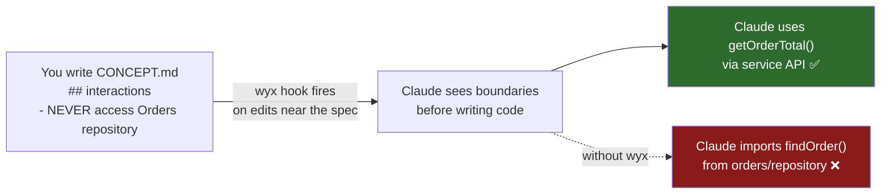

# wyx

[](https://github.com/jlifyio/wyx/releases/tag/v0.26.0) [](LICENSE) [](https://claude.com/claude-code)

**Architecture guardrails for Claude Code** — teach Claude your module boundaries. wyx automatically injects them into Claude's context whenever Claude edits files near a spec.



## What it looks like

```diff
# Without wyx — Claude reaches into module internals
- import { findOrder } from "../orders/repository"

# With wyx — Claude uses the declared service API
+ import { getOrderTotal } from "../orders/service"
```

You write a short spec describing your module boundaries. wyx injects those boundaries into Claude's context before and after every edit near the spec — Claude sees them before each edit and gets a dependency reminder after.

**In testing (N=6 features, 2 projects):** 33 cross-module imports checked, 0 violations. Small sample — see [methodology](#test-results-and-methodology) for caveats. Drift detection also caught a **silent data loss bug** — an SQL UPDATE that was missing 2 of 5 fields.

## Install

```bash
/plugin marketplace add jlifyio/claude-plugins
/plugin install wyx@jlifyio
```

Requires [Claude Code CLI](https://claude.com/claude-code) with plugin support and `jq` for JSON parsing.

> **Try it in 2 minutes** — clone the [wyx-example](https://github.com/jlifyio/wyx-example) repo, a small e-commerce project with pre-written specs and intentional drift to discover.

## How it works

**1. Create a spec** — run `/wyx:concept src/payments/` on an existing module:

```markdown
# concept: Payments [PaymentId]

## interactions
- READS order total FROM Orders (via getOrderTotal service API only)
- NEVER directly accesses Orders repository or Inventory internals

## dependencies
- Orders: read-only via getOrderTotal()
```

**2. wyx injects it automatically.** Whenever Claude writes or edits a file near this spec, the PreToolUse hook injects the boundary declarations (`## interactions`, `## dependencies`) into Claude's context before the edit. After the edit, the PostToolUse hook reinjects the dependency list as a focused reminder — catching violations that slip through during multi-file sequences.

**3. Drift detection catches divergence.** Run `/wyx:concept drift` to find where code has drifted from specs:

```
## Payments — src/payments/CONCEPT.md
### High
- Boundary violation: payments/service.ts imports orders/repository directly
  — spec says to use getOrderTotal() via service API

### Medium
- Missing action: refund() exists in code but not declared in spec
```

## Quick start

1. [Install](#install) the plugin
2. Start a Claude Code session — wyx reports existing specs automatically
3. Run `/wyx:audit` to scan the project and get a prioritized list of commands
4. Run `/wyx:concept src/your-module/` to generate a spec for an existing module
5. Edit any file in that module — wyx injects boundaries into Claude's context
6. Run `/wyx:concept drift` to check for spec-code divergence

> Start with one module, or run `/wyx:audit` to see which modules need specs most. Specs are additive — the more modules you cover, the stronger the guardrails. wyx also offers `/wyx:pipeline` for data pipelines, `/wyx:sync` for coordination patterns, and `/wyx:map` to visualize how all specs relate.

## Why not just CLAUDE.md rules?

| | CLAUDE.md rules | wyx |
|---|---|---|
| **Delivery** | Loaded in system context, project-wide | Injected before and after each write, module-specific |
| **Specificity** | Project-wide guidelines | Per-module boundary declarations |
| **Staleness** | No warning when rules diverge from code | Drift detection catches divergence |
| **Colocation** | Separate from implementation | Specs live next to the code they describe |

Both rely on Claude choosing to comply. The difference is timing and targeting — wyx puts boundaries in context at the moment Claude writes, not pages of context away.

## Skills

| Command | Produces | Purpose |
|---------|----------|---------|
| `/wyx:audit` | Action plan | Scan project for coverage gaps, suggest commands to run |
| `/wyx:concept` | `CONCEPT.md` | Define module boundaries and detect drift |
| `/wyx:pipeline` | `PIPELINE.md` | Specify data pipelines with quality invariants |
| `/wyx:sync` | `SYNCS.md` | Map coordination patterns between concepts |
| `/wyx:map` | `ARCHITECTURE.md` | Visualize all spec relationships as a Mermaid graph |

### Usage examples

```bash
/wyx:audit                           # scan project, get prioritized TODO list
/wyx:concept src/payments/          # analyze existing code
/wyx:concept Notification service   # design new module
/wyx:concept drift src/             # detect spec-code divergence
/wyx:concept                        # discover concept candidates
/wyx:pipeline src/data/             # analyze data pipeline
/wyx:sync src/syncs/                # map sync coordination
/wyx:map                            # generate full architecture map
```

<details>
<summary><strong>Install from local directory</strong></summary>

```bash
claude --plugin-dir /path/to/wyx
```

Loads the plugin for that session only — no install step. Repeat the flag to load several plugins at once.

</details>

<details>
<summary><strong>Session start hook</strong></summary>

When a project uses wyx, a SessionStart hook automatically reports existing specs:

```
wyx artifacts: CONCEPT(2: src/lib/server/concepts/indicators/CONCEPT.md,
  src/lib/server/concepts/prediction/CONCEPT.md)
  PIPELINE(1: src/lib/server/concepts/sentiment/PIPELINE.md)
  SYNCS(1: src/lib/server/syncs/SYNCS.md)
Last drift check: 2026-02-17T10:30:00Z (1 spec(s) with drift — rerun to update)
Specs modified since last drift check — consider running /wyx:concept drift
Code modified since last drift: src/lib/server/concepts/indicators,src/lib/server/concepts/prediction
Uncovered modules (>2 source files, no CONCEPT/PIPELINE/SYNCS): src/lib/components,src/lib/server/notifications
```

Reports spec coverage, drift staleness, code changes since last drift, ARCHITECTURE.md freshness, and uncovered modules (directories with >2 source files but no CONCEPT.md or PIPELINE.md). Non-concept directories (`tests/`, `docs/`, `migrations/`, `components/ui/`, `types/`, `e2e/`, `cypress/`, `fixtures/`, `stubs/`, `mocks/`, plus support dirs like `utils/`, `util/`, `helpers/`, `scripts/`, `schema/`, `schemas/`, `constants/`, `config/`) are excluded. If no specs exist, it suggests running `/wyx:audit` to get started.

</details>

<details>
<summary><strong>Spec placement</strong></summary>

Place specs next to the implementation code they describe. The PreToolUse hook walks **upward** from the edited file and stops at the **first directory containing CONCEPT.md or PIPELINE.md** (boundary-contributing specs). SYNCS.md is listed in context but does not stop traversal.

```
src/lib/
├── orders/              # one concept = one directory
│   ├── CONCEPT.md       # boundary declarations for this module
│   ├── service.ts
│   └── repository.ts
├── scoring/
│   ├── CONCEPT.md       # boundaries
│   ├── PIPELINE.md      # co-located pipeline spec (safe — same directory)
│   ├── calculate.ts
│   └── aggregate.ts
└── syncs/
    ├── SYNCS.md          # single file for ALL sync flows (keep monolithic)
    ├── order-to-inventory.ts
    └── order-to-scoring.ts
```

**Anti-patterns to avoid:**
- **Root-level CONCEPT.md** — becomes the fallback for all files, applying overly broad boundaries
- **PIPELINE.md in a subdirectory without CONCEPT.md** — e.g. `scoring/transforms/PIPELINE.md` stops traversal at `transforms/`, but the hook detects the missing CONCEPT.md and injects ancestor boundaries with a `[SHADOWED]` caveat. Co-locating specs is still preferred
- **Splitting SYNCS.md** — the coordination graph needs a complete view; partial graphs give false confidence

</details>

<details id="test-results-and-methodology">
<summary><strong>Test results and methodology</strong></summary>

Tested on 2 real projects across 6 features with a controlled baseline:

| Metric | Baseline (no wyx) | With wyx |
|--------|-------------------|----------|
| Features with boundary violations | 33% (2/6 features) | 0% (0/6 features) |
| Cross-module imports checked | — | 33 imports, 0 violations |
| Statistical significance | — | p = 0.21 feature-level (N=6) |

Tested with Claude-assisted development; untested with other LLMs. N=6 features, 2 projects, single developer. Before/after methodology — the developer's improved architectural understanding from writing specs may independently contribute to fewer violations.

Additional findings:
- Drift detection found a **real silent data loss bug** (SQL UPDATE missing 2 of 5 fields)
- Concept specs identified **4 test gaps** that human test writers had missed
- **8/8 skill tests passed** across both projects. Drift detection found 3 defects, 1 DRY violation, and 1 undocumented cross-concept dependency.

</details>

<details>
<summary><strong>Testing the plugin</strong></summary>

Test wyx against real projects using non-interactive invocations:

```bash
# Verify plugin loads and skills are discoverable
cd /path/to/project && claude --plugin-dir /path/to/wyx -p "List wyx skills"

# Test a specific skill
cd /path/to/project && claude --plugin-dir /path/to/wyx -p "/wyx:concept drift src/lib/"

# Test SessionStart hook standalone
CLAUDE_PROJECT_DIR=/path/to/project bash scripts/session-start.sh
```

</details>

<details>
<summary><strong>FAQ</strong></summary>

**Q: What if `jq` is missing?**
wyx warns at session start. Install from [jqlang.github.io](https://jqlang.github.io/jq/download/). Without jq, boundary injection is disabled.

**Q: Does wyx block bad code?**
No. wyx injects boundary context before and after each edit — Claude sees it and self-checks. It's advisory, not enforcement. In testing with Opus-class models, compliance was consistent.

**Q: Does wyx catch writes via Bash (`echo > file`, `sed -i`)?**
No. The hook matches Write, Edit, and NotebookEdit only. File modifications through Bash — or through MCP file-write tools (`mcp__server__*`) — bypass the hook entirely.

**Q: Can I use wyx with other LLMs?**
Currently tested with Claude only. The plugin mechanism is Claude Code-specific.

**Q: How many specs do I need to start?**
One. Start with the module where Claude most often violates boundaries. Each additional spec narrows the remaining gap.

</details>

## Background

wyx adapts ideas from two sources for LLM-assisted development:

- **WYSIWID**: Meng & Jackson, ["What You See Is What It Does"](https://arxiv.org/abs/2508.14511) (MIT, Onward! 2025) — concept specs and boundary declarations as a structural pattern for legible software.
- **WYWIWID**: Dr. Ernie, ["What You Write Is What It Did"](https://ihack.us/2025/11/13/what-you-write-is-what-it-did-a-legible-pattern-for-structuring-software/) — evidence-based legibility via drift detection and data pipeline invariants.

## Project structure

```
.claude-plugin/
├── plugin.json              # Plugin manifest
hooks/
└── hooks.json               # SessionStart + PreToolUse + PostToolUse hooks
scripts/
├── session-start.sh         # Artifact coverage + drift staleness + uncovered modules
├── drift-context.sh         # Boundary injection near specs (PreToolUse)
└── post-check.sh            # Dependency list reminder after edits (PostToolUse)
skills/
├── audit/SKILL.md           # /wyx:audit — project audit & command planner
├── concept/SKILL.md         # /wyx:concept — bounded concept design + drift detection
├── map/SKILL.md             # /wyx:map — architecture visualization from specs
├── pipeline/SKILL.md        # /wyx:pipeline — data pipeline specs with quality invariants
└── sync/SKILL.md            # /wyx:sync — sync coordination maps
```

## License

MIT
