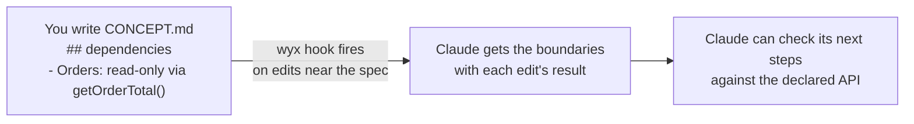

# wyx

[](https://github.com/jlifyio/wyx/releases/tag/v0.27.0) [](LICENSE) [](https://claude.com/claude-code)

**Architecture guardrails for Claude Code** — teach Claude your module boundaries. wyx automatically injects them into Claude's context whenever Claude edits files near a spec.


```mermaid
graph LR
    A["You write CONCEPT.md<br/>## dependencies<br/>- Orders: read-only via getOrderTotal()"] -->|"wyx hook fires<br/>on edits near the spec"| B["Claude gets the boundaries<br/>with each edit's result"]
    B --> C["Claude can check its next steps<br/>against the declared API"]
```

## What a boundary violation looks like

```diff
# Reaches into Orders internals
- import { findOrder } from "../orders/repository"

# Uses the declared Orders API
+ import { getOrderTotal } from "../orders/service"
```

You write a short spec describing your module boundaries. wyx adds those boundaries to Claude's context each time Claude edits a file near the spec. Claude Code delivers them together with that edit's result, so Claude reads them after the edit is written and can apply them to its next steps. A dependency reminder follows each edit.

**Evidence so far is thin.** An early before/after test (N=6 features) saw 0 violations in 33 cross-module imports; a later concurrent pilot (27 runs, 2026) found no detectable difference with or without wyx under deliberate pressure — see [methodology](#test-results-and-methodology). A follow-up (16 runs) loaded the boundary sections at launch as `.claude/rules/`: none of those 8 runs added a reach-in (7 of 8 without), but each edited the module it had been asked to avoid instead. Drift detection also caught a **silent data loss bug** — an SQL UPDATE that was missing 2 of 5 fields.

## Install

```bash
/plugin marketplace add jlifyio/claude-plugins
/plugin install wyx@jlifyio
```

Requires [Claude Code CLI](https://claude.com/claude-code) with plugin support and `jq` for JSON parsing.

> **Try it in 2 minutes** — clone the [wyx-example](https://github.com/jlifyio/wyx-example) repo, a small e-commerce project with pre-written specs and intentional drift to discover.

## How it works

**1. Create a spec** — run `/wyx:concept src/payments/` on an existing module:

```markdown
# concept: Payments [PaymentId]

## interactions
- Reads the order total through `Orders.getOrderTotal()`; the Orders repository and Inventory internals are private to those concepts, so Payments does not import them

## dependencies
- Orders: read-only via getOrderTotal()
```

**2. wyx injects it automatically.** Whenever Claude writes or edits a file near this spec, the PreToolUse hook adds the boundary declarations (`## interactions`, `## dependencies`) to Claude's context. The hook runs before the edit is applied, but Claude receives its output with the edit's result, so the edit that triggered it — and any other edits in the same response — are written without it. After the edit, the PostToolUse hook adds the dependency list as a reminder.

**3. Drift detection catches divergence.** Run `/wyx:concept drift` to find where code has drifted from specs:

```
## Payments — src/payments/CONCEPT.md
### High
- Boundary violation: payments/service.ts imports orders/repository directly
  — spec says to use getOrderTotal() via service API

### Medium
- Missing action: refund() exists in code but not declared in spec
```

## Quick start

1. [Install](#install) the plugin
2. Start a Claude Code session — wyx reports existing specs automatically
3. Run `/wyx:audit` to scan the project and get a prioritized list of commands
4. Run `/wyx:concept src/your-module/` to generate a spec for an existing module
5. Edit any file in that module — wyx injects boundaries into Claude's context
6. Run `/wyx:concept drift` to check for spec-code divergence

> Start with one module, or run `/wyx:audit` to see which modules need specs most. Specs are additive — the more modules you cover, the stronger the guardrails. wyx also offers `/wyx:pipeline` for data pipelines, `/wyx:sync` for coordination patterns, and `/wyx:map` to visualize how all specs relate.

## Why not just CLAUDE.md rules?

| | CLAUDE.md, nested CLAUDE.md, `.claude/rules/` | wyx |
|---|---|---|
| **Delivery** | At launch: CLAUDE.md from the working directory up, and rules without `paths`. On read: nested CLAUDE.md and path-scoped rules for the file Claude reads (path-scoped rules load only via the Read tool; `cat` through Bash does not load them — observed on Claude Code 2.1.281) | After each write near a spec, delivered with the write's result |
| **Format** | Free-form instructions for Claude | Structured spec (purpose, state, actions, boundaries) that people review too |
| **Staleness** | No check against the code | Drift detection compares spec and code |
| **Colocation** | Nested CLAUDE.md sits in its directory; `.claude/rules/` usually at the project root | Next to the code it describes |

All of these rely on Claude choosing to comply. Nested CLAUDE.md and path-scoped rules already give Claude module-specific context when it reads a file; wyx adds a reminder after each write, a spec format that doubles as design documentation, and drift detection. Pilot-01 compared wyx with the same boundary sections loaded as path-scoped rules and found no detectable difference; wyx's boundaries reached Claude before its first edit in none of 9 runs, the path-scoped rules in 2 of 9. Pilot-02 loaded them at launch as rules without `paths`, and Claude then put the import rules ahead of the user's request to stay in one module (see Test results and the FAQ).

## Skills

| Command | Produces | Purpose |
|---------|----------|---------|
| `/wyx:audit` | Action plan | Scan project for coverage gaps, suggest commands to run |
| `/wyx:concept` | `CONCEPT.md` | Define module boundaries and detect drift |
| `/wyx:pipeline` | `PIPELINE.md` | Specify data pipelines with quality invariants |
| `/wyx:sync` | `SYNCS.md` | Map coordination patterns between concepts |
| `/wyx:map` | `ARCHITECTURE.md` | Visualize all spec relationships as a Mermaid graph |

### Usage examples

```bash
/wyx:audit                           # scan project, get prioritized TODO list
/wyx:concept src/payments/          # analyze existing code
/wyx:concept Notification service   # design new module
/wyx:concept drift src/             # detect spec-code divergence
/wyx:concept                        # discover concept candidates
/wyx:pipeline src/data/             # analyze data pipeline
/wyx:sync src/syncs/                # map sync coordination
/wyx:map                            # generate full architecture map
```

<details>
<summary><strong>Install from local directory</strong></summary>

```bash
claude --plugin-dir /path/to/wyx
```

Loads the plugin for that session only — no install step. Repeat the flag to load several plugins at once.

</details>

<details>
<summary><strong>Session start hook</strong></summary>

When a project uses wyx, a SessionStart hook automatically reports existing specs:

```
wyx artifacts: CONCEPT(2: src/lib/server/concepts/indicators/CONCEPT.md,
  src/lib/server/concepts/prediction/CONCEPT.md)
  PIPELINE(1: src/lib/server/concepts/sentiment/PIPELINE.md)
  SYNCS(1: src/lib/server/syncs/SYNCS.md)
Last drift check: 2026-02-17T10:30:00Z (1 spec(s) with drift — rerun to update)
Specs modified since last drift check — consider running /wyx:concept drift
Code modified since last drift: src/lib/server/concepts/indicators,src/lib/server/concepts/prediction
Uncovered modules (>2 source files, no CONCEPT/PIPELINE/SYNCS): src/lib/components,src/lib/server/notifications
```

Reports spec coverage, drift staleness, code changes since last drift, ARCHITECTURE.md freshness, and uncovered modules (directories with >2 source files but no CONCEPT.md or PIPELINE.md). Non-concept directories (`tests/`, `docs/`, `migrations/`, `components/ui/`, `types/`, `e2e/`, `cypress/`, `fixtures/`, `stubs/`, `mocks/`, plus support dirs like `utils/`, `util/`, `helpers/`, `scripts/`, `schema/`, `schemas/`, `constants/`, `config/`) are excluded. If no specs exist, it suggests running `/wyx:audit` to get started.

</details>

<details>
<summary><strong>Spec placement</strong></summary>

Place specs next to the implementation code they describe. The PreToolUse hook walks **upward** from the edited file and stops at the **first directory containing CONCEPT.md or PIPELINE.md** (boundary-contributing specs). SYNCS.md is listed in context but does not stop traversal.

```
src/lib/
├── orders/              # one concept = one directory
│   ├── CONCEPT.md       # boundary declarations for this module
│   ├── service.ts
│   └── repository.ts
├── scoring/
│   ├── CONCEPT.md       # boundaries
│   ├── PIPELINE.md      # co-located pipeline spec (safe — same directory)
│   ├── calculate.ts
│   └── aggregate.ts
└── syncs/
    ├── SYNCS.md          # single file for ALL sync flows (keep monolithic)
    ├── order-to-inventory.ts
    └── order-to-scoring.ts
```

**Anti-patterns to avoid:**
- **Root-level CONCEPT.md** — becomes the fallback for all files, applying overly broad boundaries
- **PIPELINE.md in a subdirectory without CONCEPT.md** — e.g. `scoring/transforms/PIPELINE.md` stops traversal at `transforms/`, but the hook detects the missing CONCEPT.md and injects ancestor boundaries with a `[SHADOWED]` caveat. Co-locating specs is still preferred
- **Splitting SYNCS.md** — the coordination graph needs a complete view; partial graphs give false confidence

</details>

<details id="test-results-and-methodology">
<summary><strong>Test results and methodology</strong></summary>

Tested on 2 real projects across 6 features against a before/after baseline:

| Metric | Baseline (no wyx) | With wyx |
|--------|-------------------|----------|
| Features with boundary violations | 33% (2/6 features) | 0% (0/6 features) |
| Cross-module imports checked | — | 33 imports, 0 violations |
| Statistical significance | — | p = 0.21 feature-level (N=6) |

Tested with Claude-assisted development; untested with other LLMs. N=6 features, 2 projects, single developer. Before/after methodology — the developer's improved architectural understanding from writing specs may independently contribute to fewer violations. The two periods were not concurrent, so model or Claude Code updates between them are a further uncontrolled factor. These figures predate the PostToolUse reminder (added in v0.22.0), so they say nothing about it. [docs/evaluation-protocol.md](docs/evaluation-protocol.md) describes a concurrent A/B protocol for re-measuring.

Additional findings:
- Drift detection found a **real silent data loss bug** (SQL UPDATE missing 2 of 5 fields)
- Concept specs identified **4 test gaps** that human test writers had missed
- **8/8 skill tests passed** across both projects. Drift detection found 3 defects, 1 DRY violation, and 1 undocumented cross-concept dependency.

**Pilot-01 (2026-09, concurrent A/B, descriptive).** 27 runs of claude-opus-5-5 (effort high, Claude Code 2.1.281) on a 17-file fixture: 3 tasks × 3 arms × 3 runs. B had the specs only, C had wyx v0.27.0, and D had the same boundary sections as path-scoped `.claude/rules/`. Every task combined two pressures: an existing reach-in in the file being edited, and a prompt asking to keep a hotfix inside one module to avoid another team's review (with at most one of the two, specs-only runs made no reach-in in 9 design runs). The outcome was whether the final code gained a runtime import of another module's repository. Violations: B 6/9, C 5/9, D 4/9 (T1 3/3, 3/3, 2/3; T2 0/3, 0/3, 1/3; T3 3/3, 2/3, 1/3). No difference between arms could be detected; at this size only differences of about 55 percentage points are visible, so the pilot neither shows nor rules out a smaller effect. Every run read CONCEPT.md before its first edit, and every violating run said it had crossed the boundary, so the pilot tested whether wyx changes a deliberate trade-off, not whether it prevents accidental reach-ins. In all 9 wyx runs Claude wrote its whole code change in one response, before any boundary injection reached it (only wyx's session-start summary and skill listings came earlier), and no wyx run changed its code afterwards. Path-scoped rules reached Claude before its first edit in 2 of 9 runs, because they load only when Claude uses the Read tool and most runs read files with `cat`. One model, one small fixture, and the maintainer's own global configuration in every arm. Harness and full report: [wyx-example/eval/pilot-01](https://github.com/jlifyio/wyx-example/tree/main/eval/pilot-01); decision: DEC-025.

**Pilot-02 (2026-09, concurrent A/B, descriptive).** 16 runs, same model, fixture and pressures, on the two tasks where specs-only runs reached in: B had the specs only, E also had the boundary sections as `.claude/rules/` without `paths`, which Claude Code loads at launch (confirmed in 8/8 E runs, before the first response). New repository reach-ins: B 7/8, E 0/8, which meets the pre-registered screening rule. The fixture offers two complete fixes, and every E run took the one without a reach-in: it added a public function to the module the prompt asked it to avoid, so the change would wait for that team's review (8/8, against 1/8 in B). Every run said which choice it made. B runs had read the same boundaries in CONCEPT.md before their first edit, so the rules changed how Claude ranked a boundary it already knew against the user's scope request. At least one pre-existing reach-in stayed in every E tree. The pilot cannot tell whether launch timing, the instruction channel, the rules' position and repetition, the wording or the all-module scope did it, and it changes nothing in wyx. One model, one small fixture, and the maintainer's own global configuration in both arms. Harness, pre-registration and report: [wyx-example/eval/pilot-02](https://github.com/jlifyio/wyx-example/tree/main/eval/pilot-02); decision: DEC-027.

</details>

<details>
<summary><strong>Testing the plugin</strong></summary>

Test wyx against real projects using non-interactive invocations:

```bash
# Verify plugin loads and skills are discoverable
cd /path/to/project && claude --plugin-dir /path/to/wyx -p "List wyx skills"

# Test a specific skill
cd /path/to/project && claude --plugin-dir /path/to/wyx -p "/wyx:concept drift src/lib/"

# Test SessionStart hook standalone
CLAUDE_PROJECT_DIR=/path/to/project bash scripts/session-start.sh
```

</details>

<details>
<summary><strong>FAQ</strong></summary>

**Q: What if `jq` is missing?**
wyx warns at session start. Install from [jqlang.github.io](https://jqlang.github.io/jq/download/). Without jq, boundary injection is disabled.

**Q: Does wyx block bad code?**
No. wyx adds boundary context after each edit near a spec, and Claude can check its later steps against it. It is advisory and arrives after the edit that triggers it. In pilot-01, under pressure to keep a hotfix inside one module, the pilot found no detectable difference in whether Claude imported another module's repository (5 of 9 runs with wyx, 6 of 9 without; only differences of about 55 points are visible at that size). If you need a deterministic check, run an import checker (for example dependency-cruiser or import-linter) as your own PostToolUse hook: it reports violations to Claude right after each write (it cannot undo the write) and works alongside wyx.

**Q: Can I make Claude put the boundaries ahead of a request to stay in one module?**
Possibly, outside wyx: copy each spec'd module's `## interactions` and `## dependencies` sections into `.claude/rules/<module>.md` at the project root, with no `paths` frontmatter, so Claude Code loads them at launch as project instructions. In pilot-02 (one small fixture, one model, 8 runs per arm, the maintainer's global configuration in both arms), no run with these rules added an import of another module's repository (0 of 8, against 7 of 8 with the specs alone). The fixture allows only two complete fixes, so every one of those runs changed the module the user had asked it to avoid instead, and said so. Choose it if you would rather wait for the other team's review than accept a reach-in. Those runs also edited the spec's `## dependencies`, which left the copies out of date: wyx does not generate them and `/wyx:concept drift` does not check them, so update them when a spec changes.

**Q: Does wyx catch writes via Bash (`echo > file`, `sed -i`)?**
No. The hook matches Write, Edit, and NotebookEdit only. File modifications through Bash — or through MCP file-write tools (`mcp__server__*`) — bypass the hook entirely.

**Q: Can I use wyx with other LLMs?**
Currently tested with Claude only. The plugin mechanism is Claude Code-specific.

**Q: How many specs do I need to start?**
One. Start with the module where Claude most often violates boundaries. Each additional spec narrows the remaining gap.

</details>

## Background

wyx adapts ideas from **WYSIWID** — Meng & Jackson, ["What You See Is What It Does"](https://arxiv.org/abs/2508.14511) (MIT, Onward! 2025), a structural pattern for legible software: independent concepts (purpose, state, actions, operational principle) composed by synchronizations that an engine executes. wyx takes its concept spec format and its concept/sync vocabulary and applies them to LLM-assisted development.

<details>
<summary><strong>How wyx differs from WYSIWID</strong></summary>

wyx works on conventional code — existing codebases, and new code written without a concept runtime — so it relaxes the pattern where such code cannot follow it:

- **Concepts may call each other's actions.** In WYSIWID a concept knows nothing of other concepts, not even their interfaces, and all cross-concept control flow goes through synchronizations. wyx lets a concept call another's declared actions and records that in `## dependencies`; `## known coupling` documents intentional direct data access, each entry with a keep/refactor/defer status. The boundary sections the hooks inject are wyx's addition, not part of WYSIWID.
- **Syncs are documentation, not code.** WYSIWID synchronizations are declarative rules that an engine runs. `SYNCS.md` describes sync handlers implemented in ordinary code, and `/wyx:concept drift` checks the two against each other after the fact.
- **No runtime.** The WYSIWID engine logs every action with its provenance — the synchronization that caused it. wyx ships no engine and no action log: only specs, hooks, and LLM drift checks.

A later paper by Meng, Jackson and colleagues, ["Making Software Meaningful"](https://arxiv.org/abs/2606.11051) (2026), describes a TypeScript implementation of the pattern for LLM code generation. For new code where full concept independence is the goal, that approach builds it into the structure; wyx is a guardrail for code that lacks it.

</details>

See also: Dr. Ernie, ["What You Write Is What It Did"](https://ihack.us/2025/11/13/what-you-write-is-what-it-did-a-legible-pattern-for-structuring-software/) — a data-centred response to WYSIWID built on stateless workers, immutable artifacts, declarative specs, and provenance logs.

## Project structure

```
.claude-plugin/
├── plugin.json              # Plugin manifest
hooks/
└── hooks.json               # SessionStart + PreToolUse + PostToolUse hooks
scripts/
├── session-start.sh         # Artifact coverage + drift staleness + uncovered modules
├── drift-context.sh         # Boundary injection near specs (PreToolUse)
└── post-check.sh            # Dependency list reminder after edits (PostToolUse)
skills/
├── audit/SKILL.md           # /wyx:audit — project audit & command planner
├── concept/SKILL.md         # /wyx:concept — bounded concept design + drift detection
├── map/SKILL.md             # /wyx:map — architecture visualization from specs
├── pipeline/SKILL.md        # /wyx:pipeline — data pipeline specs with quality invariants
└── sync/SKILL.md            # /wyx:sync — sync coordination maps
```

## License

MIT
