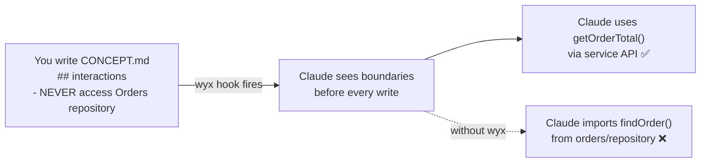

# Demo GIF Recording Guide

## Quick Start

```bash
# 1. Install vhs
brew install charmbracelet/tap/vhs  # macOS
# or: go install github.com/charmbracelet/vhs@latest

# 2. Clone the example project
git clone https://github.com/jlifyio/wyx-example
cd wyx-example

# 3. Record the demo
vhs /path/to/wyx/docs/assets/demo.tape
```

The tape file produces `docs/assets/demo.gif` — a ~20 second terminal recording showing:
1. A concept spec (what you write)
2. Drift detection running (what wyx finds)
3. The boundary violation it caught (the payoff)

## Important Notes

- **The `claude -p` command in Beat 2 runs Claude non-interactively.** The output depends on wyx being installed as a plugin. If this doesn't produce clean output, replace Beat 2 with a pre-recorded output using vhs `Type` commands that simulate the drift detection result.
- **Test the tape first** with `vhs demo.tape` before committing the GIF.
- **Target: 15-20 seconds.** The GIF auto-loops on GitHub — keep it tight.
- **A bad GIF is worse than no GIF.** If the recording isn't clear, use the fallback approach below.

## Fallback: Static Screenshots

If the GIF doesn't look good, create 3 annotated screenshots instead:

1. **Screenshot 1**: `cat src/payments/CONCEPT.md` showing the spec with `## interactions` highlighted
2. **Screenshot 2**: Drift detection output showing the boundary violation found
3. **Screenshot 3**: `head -5 src/payments/service.ts` showing `import { findOrder } from "../orders/repository"` — the violation

Place in README as:
```markdown
| The spec | What wyx found | The violation |
|----------|---------------|---------------|
|  |  |  |
```

## Alternative: Mermaid Diagram

For a zero-asset approach, use an inline Mermaid diagram in the README:



## After Recording

1. Verify GIF size (should be under 5MB for fast GitHub loading)
2. Uncomment the GIF line in README.md:
   ```markdown
   
   ```
3. Commit: `git add docs/assets/demo.gif README.md && git commit -m "docs: add demo GIF"`
