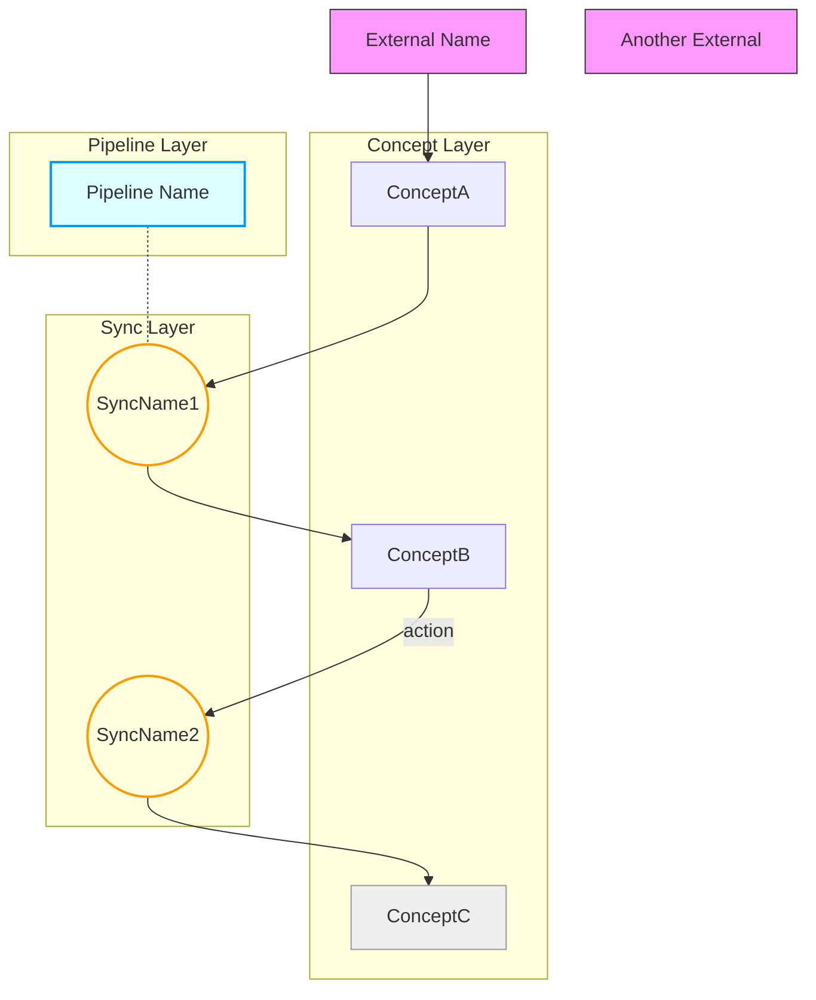

# Architecture Map Generation

Generate an **architecture map** — a synthesized view of all concept, pipeline,
and sync specs in a project. The map shows how concepts relate to each other, where data
flows, and which external systems are involved. It produces a single `ARCHITECTURE.md`
with a Mermaid relationship graph, dependency matrix, and data flow paths. ARCHITECTURE.md is a human reference document for orientation and code review — it is not consumed by wyx hooks.

## How to interpret $ARGUMENTS

Determine the mode from the argument:

- **Path** (e.g. `src/lib/server/`): **Scoped mode** — only map specs found under this path. Useful for mapping a subsystem without noise from unrelated modules.
- **No arguments**: **Full project mode** — find and map all wyx specs across the entire project. This is the most common usage. For projects with 15+ concepts, recommend scoped mode to keep the graph readable.
- **Zero specs found**: Output "No wyx specs found. Run `/wyx:concept` first to create your first spec." and stop.

## Step 1: Discover All Specs

1. Glob for `**/CONCEPT.md`, `**/PIPELINE.md`, and `**/SYNCS.md` (scoped to path if given)
2. Read every spec found
3. Build an inventory: for each spec, record its type, name, directory, and key sections

### Parallel reading

When 5+ specs are found, use `Agent` with `subagent_type: "Explore"` to read specs in parallel. Explore agents are read-only (Write/Edit structurally unavailable).

- Spawn one Explore agent per 3-5 specs grouped by directory proximity
- Each agent reads the specs and returns: type, name, directory, and key sections (interactions, dependencies, data boundary, coordination graph)
- After all agents complete, merge the inventory in the main context and proceed to Step 2

## Step 2: Extract Relationships

Derive the graph edges from specs using this **priority order** (higher = more authoritative):

1. **SYNCS.md `## coordination graph`** — Parse the text diagram. Each `[Source] --(action)--> (SyncName) --> [Target]` becomes edges.
2. **CONCEPT.md `## dependencies`** — Each dependency bullet becomes an edge. External deps (APIs, CLIs, databases, env vars) become `:::external` nodes.
3. **CONCEPT.md `## interactions`** — Each interaction bullet becomes an edge. Use `-.->` for ambiguous direction.
4. **PIPELINE.md `## data boundary`** — Each ownership declaration shows which concept owns which data.
5. **PIPELINE.md `## purpose`** — Used for pipeline node labels.

**Edge direction convention**: Provider TO consumer. "A depends on B" means `B --> A`. "A calls B.action()" means `A --> B`. Ambiguous direction: use `-.->` (dashed).

**Edge labels**: Use the EXACT verb from the spec. No paraphrasing. If spec says "calls generate()", label is `generate`. If spec says "reads recommendations", label is `reads recs`.

## Step 3: Build Node IDs

**Node ID derivation**: First letter of each CamelCase word, uppercase. StockData becomes SD, ScheduledEvents becomes SE. On collision, append digit (SR1, SR2).

**Node shapes by type**:
- Concept nodes: `ID["ConceptName"]` (rectangle, default style)
- Sync nodes: `ID(("ShortName")):::sync` (double parentheses = circle)
- Pipeline nodes: `ID["Pipeline Name"]:::pipeline` (rectangle with pipeline class)
- External nodes: `ID["External Name"]:::external` (rectangle, listed before concept subgraph)
- Infrastructure concepts: `ID["Name"]:::infra` (for utility/infra concepts like loggers)

## ARCHITECTURE.md Format

Write the output as `ARCHITECTURE.md` in the project root (or scoped directory root).

Use this exact structure:

````markdown
# architecture: [Project Name]

> Generated by `/wyx:map` on [YYYY-MM-DD]

## relationship graph



## dependency matrix

| Concept | Depends On | Depended By |
|---------|-----------|-------------|
| ConceptA | External (ext) | ConceptB (via sync) |
| ConceptB | ConceptA | ConceptC (via sync) |
| ConceptC | ConceptB | -- (terminal) |

## data flow paths

**[Business flow description]:** Concept1 -> Concept2 -> Concept3 — [one-line summary of what this path does end-to-end]
**[Business flow description]:** Concept4 -> Concept5 — [one-line summary]

## coverage

- **12/18 modules specced (67%)**
- Specced: `src/lib/auth/CONCEPT.md`, `src/lib/data/PIPELINE.md`, ...
- Uncovered: `src/lib/notifications/`, `src/lib/billing/`, ...
````

## Output Stability Rules

These ensure reproducible output across invocations:

1. **Node ordering**: Concepts listed alphabetically by name within each subgraph. External nodes alphabetically before the concept subgraph.
2. **Subgraph ordering**: Fixed layer order: External nodes -> Concept Layer -> Sync Layer -> Pipeline Layer. Omit empty layers (e.g. no pipelines subgraph if no PIPELINE.md found).
3. **Edge ordering**: Grouped by source node (alphabetical), then by target (alphabetical) within each source.
4. **classDef styles**: Copy these EXACTLY — hardcoded hex values, never choose different colors:
   - `classDef external fill:#f9f,stroke:#333,stroke-width:1px`
   - `classDef sync fill:#ffd,stroke:#f90,stroke-width:2px`
   - `classDef pipeline fill:#dff,stroke:#09f,stroke-width:2px`
   - `classDef infra fill:#eee,stroke:#999,stroke-width:1px`
5. **Edge direction**: Provider TO consumer (see Step 2 convention).
6. **Table row ordering**: Alphabetical by concept name.
7. **Edge labels**: Exact verbs from specs, never paraphrased.

## Mermaid Syntax Safety Rules

These prevent rendering failures:

- **No emoji** in node labels (breaks Mermaid parser)
- **No `~~~`** (invisible links) — use `-.-` for dotted association lines
- **No `stroke-dasharray`** in classDef
- **Short node IDs** (max ~15 chars in labels)
- **Quote labels with spaces**: `["Pipeline Name"]` not `[Pipeline Name]`
- **Duplicate edges**: Same node pair with multiple relationships must use different labels to distinguish (e.g. `RD -->|sessionEnded| SP` and `RD -->|stateChanged| SP`). Labelless duplicate edges are merged by Mermaid into a single line.

## Mermaid Design Constraints

These are intentional design choices, not parser limitations:

- **No nested subgraphs** — Mermaid has open rendering bugs with nesting (#2345: label cutoff, #6438/#4648: direction inheritance). Use `:::infra` classDef for infrastructure concepts instead.
- **No linking TO subgraph names** — link to nodes inside subgraphs for predictable edge routing (#6626).

## After Generating

1. Write the `ARCHITECTURE.md` file immediately (it is fully derived and always regenerable)
2. Present a brief summary: node count, edge count, key patterns observed, and coverage stats
3. If `ARCHITECTURE.md` already exists, overwrite it — no confirmation needed
4. Note: Mermaid graphs render visually on GitHub and VS Code; in terminal they appear as raw text (still human-parseable)

## Relationship to Other wyx Skills

- **`/wyx:concept`**: The primary data source. Each CONCEPT.md's `## interactions` and `## dependencies` feed into the architecture map's edges and dependency matrix.
- **`/wyx:pipeline`**: PIPELINE.md's `## data boundary` and `## purpose` contribute pipeline nodes and data ownership edges.
- **`/wyx:sync`**: SYNCS.md's `## coordination graph` is the most authoritative source for sync flow edges. The map synthesizes what SYNCS.md shows locally into a project-wide view.
- **`/wyx:concept drift`**: Use drift detection to ensure specs are current before generating the map. An architecture map from stale specs is misleading.
