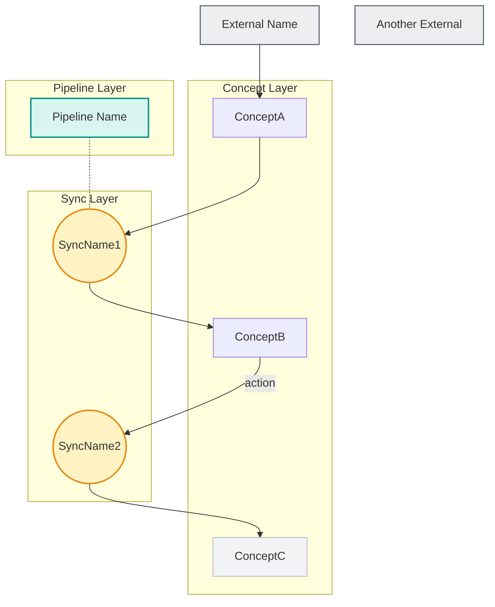

# Architecture Map Generation

Generate an **architecture map** — a synthesized view of all concept, pipeline,
and sync specs in a project. The map shows how concepts relate to each other, where data
flows, and which external systems are involved. It produces a single `ARCHITECTURE.md`
with a Mermaid relationship graph, dependency matrix, and data flow paths. ARCHITECTURE.md is a human reference document for orientation and code review — it is not consumed by wyx hooks.

## How to interpret $ARGUMENTS

Determine the mode from the argument:

- **Path** (e.g. `src/lib/server/`): **Scoped mode** — only map specs found under this path. Useful for mapping a subsystem without noise from unrelated modules.
- **No arguments**: **Full project mode** — find and map all wyx specs across the entire project. This is the most common usage. For projects with 15+ concepts, recommend scoped mode to keep the graph readable.
- **Zero specs found**: Output "No wyx specs found. Run `/wyx:concept` first to create your first spec." and stop.

## Pre-check: Skip if Clean

Before reading all specs, check if regeneration is needed:

1. If `ARCHITECTURE.md` exists in the target directory, compare its modification time against all spec files
2. Use `find . -name "CONCEPT.md" -o -name "PIPELINE.md" -o -name "SYNCS.md" -newer ARCHITECTURE.md` (scoped to path if given) to find specs modified since last generation
3. If no spec file is newer, report: "ARCHITECTURE.md is up to date (generated: [date], no spec changes since)" and stop
4. If any spec file is newer, read only the graph-contributing sections (`## interactions`, `## dependencies`, `## data boundary`, `## coordination graph`, and PIPELINE.md's `## purpose` — these are exactly the graph-derivation sources in Step 2; the set is intentionally identical so a skip never silences a real graph change) of changed specs. If the **text** of those sections is byte-identical (compare via `git diff` — a textual comparison, never a rendered-graph judgment; byte-identical watched text guarantees an identical derived graph) — and only after actually performing that comparison, never as a blind skip — insert or update a `> Verified current on [today's date]` line immediately below the `> Generated by` header in `ARCHITECTURE.md` (leave the `> Generated by` line untouched — the graph was not regenerated, only re-confirmed; this Write bumps the file's mtime so the SessionStart staleness check stops re-firing every session). Then report: "ARCHITECTURE.md is up to date (graph sections unchanged — verified current [today's date])" and stop. Otherwise, or if `ARCHITECTURE.md` doesn't exist, proceed to Step 1

## Step 1: Discover All Specs

1. Glob for `**/CONCEPT.md`, `**/PIPELINE.md`, and `**/SYNCS.md` (scoped to path if given)
2. Read every spec found
3. Build an inventory: for each spec, record its type, name, directory, and key sections

### Parallel reading

When 10+ specs are found, use `Agent` with `subagent_type: "Explore"` to read specs in parallel. Below 10, direct Read is faster (agent spawning overhead exceeds read time). Explore agents are read-only (Write/Edit structurally unavailable).

- Spawn one Explore agent per 3-5 specs grouped by directory proximity
- Each agent reads the specs and returns: type, name, directory, and key sections (interactions, dependencies, data boundary, coordination graph)
- After all agents complete, merge the inventory in the main context and proceed to Step 2

## Step 2: Extract Relationships

Derive the graph edges from specs using this **priority order** (higher = more authoritative):

1. **SYNCS.md `## coordination graph`** — Parse the text diagram. Each `[Source] --(action)--> (SyncName) --> [Target]` becomes edges.
2. **CONCEPT.md `## dependencies`** — Each dependency bullet becomes an edge. External deps (APIs, CLIs, databases, env vars) become `:::external` nodes.
3. **CONCEPT.md `## interactions`** — Each interaction bullet becomes an edge. Use `-.->` for ambiguous direction.
4. **PIPELINE.md `## data boundary`** — Each ownership declaration shows which concept owns which data.
5. **PIPELINE.md `## purpose`** — Used for pipeline node labels.

**Edge direction convention**: Provider TO consumer. "A depends on B" means `B --> A`. "A calls B.action()" means `A --> B`.

**Dashed edge convention** (`-.->`): Use for relationships that are indirect, optional, or navigational rather than hard dependencies:
- Ambiguous direction (unclear provider/consumer)
- Optional foreign keys or soft references (e.g., nullable FK, lookup by convention)
- Navigational associations (read-only cross-references, not ownership)

**Edge labels**: Use the EXACT verb from the spec. No paraphrasing. If spec says "calls generate()", label is `generate`. If spec says "reads recommendations", label is `reads recs`.

**Unspecced references**: When a SYNCS.md `## coordination graph` or CONCEPT.md `## interactions` references a concept that has no corresponding CONCEPT.md, include it as a regular node in the graph and flag it in the `## coverage` section (e.g., "Referenced but unspecced: Unlinked (in SYNCS.md)"). Do not use `:::external` — these are internal modules that lack specs, not external systems.

## Step 3: Build Node IDs

**Node ID derivation**: First letter of each CamelCase word, uppercase. StockData becomes SD, ScheduledEvents becomes SE. On collision, append digit (SR1, SR2).

**Node shapes by type**:
- Concept nodes: `ID["ConceptName"]` (rectangle, default style)
- Sync nodes: `ID(("ShortName")):::sync` (double parentheses = circle)
- Pipeline nodes: `ID["Pipeline Name"]:::pipeline` (rectangle with pipeline class)
- External nodes: `ID["External Name"]:::external` (rectangle, listed before concept subgraph)
- Infrastructure concepts: `ID["Name"]:::infra` — an **optional cosmetic style** only. Do NOT derive it: there is no deterministic test for "is this infra" (authors legitimately model a functionally-identical persistence concept as either a plain concept node or `:::infra`). No map rule reads this label; it sets colour alone. Preserve an `:::infra` the spec or a prior map already used; never add or strip one as a "fix."

## ARCHITECTURE.md Format

Write the output as `ARCHITECTURE.md` in the project root (or scoped directory root).

Use this exact structure:

````markdown
# architecture: [Project Name]

> Generated by `/wyx:map` on [YYYY-MM-DD]
> Verified current on [YYYY-MM-DD]  <!-- omit on a fresh generation; Step 4's skip path writes this line when it re-confirms the graph is unchanged -->

## relationship graph



## dependency matrix

| Concept | Depends On | Depended By |
|---------|-----------|-------------|
| ConceptA | External (ext) | ConceptB (via sync) |
| ConceptB | ConceptA | ConceptC (via sync) |
| ConceptC | ConceptB | -- (terminal) |

## data flow paths

**[Business flow description]:** Concept1 -> Concept2 -> Concept3 — [one-line summary of what this path does end-to-end]
**[Business flow description]:** Concept4 -> Concept5 — [one-line summary]

## coverage

- **12/18 modules specced (67%)**
- Specced: `src/lib/auth/CONCEPT.md`, `src/lib/data/PIPELINE.md`, ...
- Uncovered: `src/lib/notifications/`, `src/lib/billing/`, ...
````

## Output Stability Rules

These ensure reproducible output across invocations:

1. **Node ordering**: Concepts listed alphabetically by name within each subgraph. External nodes alphabetically before the concept subgraph.
2. **Subgraph ordering**: Fixed layer order: External nodes -> Concept Layer -> Sync Layer -> Pipeline Layer. Omit empty layers (e.g. no pipelines subgraph if no PIPELINE.md found).
3. **Edge ordering**: Grouped by source node (alphabetical), then by target (alphabetical) within each source.
4. **classDef styles**: Copy these EXACTLY — hardcoded hex values, never choose different colors. Concept nodes are intentionally left to Mermaid's default style so the concept layer (the protagonist) reads as the baseline; the supporting layers sit in one muted saturation band so none of them out-shouts the concepts (external is a muted neutral boundary, not a loud fill):
   - `classDef external fill:#eceef0,stroke:#5c6770,stroke-width:1.5px`
   - `classDef sync fill:#fff3c4,stroke:#e8870c,stroke-width:2px`
   - `classDef pipeline fill:#d8f5f0,stroke:#0c9488,stroke-width:2px`
   - `classDef infra fill:#f1f3f5,stroke:#b0b7be,stroke-width:1px`
5. **Edge direction**: Provider TO consumer (see Step 2 convention).
6. **Table row ordering**: Alphabetical by concept name.
7. **Edge labels**: Exact verbs from specs, never paraphrased.
8. **Matrix cell enumeration**: A dependency-matrix cell MUST name its members; never collapse them to a quantifier (`All concepts`, `N of M`, `5/7`). This operates on the cell in place — it adds no node, reclassifies nothing, and never pushes a dependency into other rows (`:::external` stores stay text deps in their consumers' Depends-On; a fan-to-all concept enumerates only in its own Depended-By cell, never smeared across every consumer's Depends-On). Scope: concept and infra rows; external and sync nodes are exempt (they have no concept row). A quantifier cell passes a row-presence check while defeating reconciliation against the graph's fan edges — and is often false (e.g. "All concepts" for a store that serves 19 of 26, which hides exactly the no-own-table concepts that are wyx's redundant-data-store signal, Design Rule 5).

## Mermaid Syntax Safety Rules

These prevent rendering failures:

- **No emoji** in node labels (breaks Mermaid parser)
- **No `~~~`** (invisible links) — use `-.-` for dotted association lines
- **No `stroke-dasharray`** in classDef
- **Short node IDs** (max ~15 chars in labels)
- **Quote labels with spaces**: `["Pipeline Name"]` not `[Pipeline Name]`
- **Duplicate edges**: Same node pair with multiple relationships must use different labels to distinguish (e.g. `RD -->|sessionEnded| SP` and `RD -->|stateChanged| SP`). Labelless duplicate edges are merged by Mermaid into a single line.

## Mermaid Design Constraints

These are intentional design choices, not parser limitations:

- **No nested subgraphs** — Mermaid has open rendering bugs with nesting (#2345: label cutoff, #6438/#4648: direction inheritance). Use the `:::infra` classDef for infrastructure concepts instead.
- **No linking TO subgraph names** — link to nodes inside subgraphs for predictable edge routing (#6626). This includes summarising a fan-out: never write `Node -.-> layerName` to mean "fans out to that whole layer." Emit each fan-out edge to the individual nodes instead; the full relationship is captured losslessly per-node in the dependency matrix (Output Stability Rule 8), never relocated out of the graph. A dense node (e.g. a store every concept persists to) therefore keeps all its individual edges — see the density note below.
- **Visual density is unsolved by design** — a large or highly-connected project renders as a dense graph, and there is no deterministic, classification-free rule that thins it. Every candidate (collapsing an "infra" fan, clustering by domain, an adaptive overview) requires identifying *which* node/edge is infra or *which* domain a concept belongs to, and no machine-readable signal for either exists in the spec format; an inferred one coin-flips run-to-run and would churn `git diff`. Determinism and a trustworthy `git diff` are prioritised over rendered density. The escape hatch for readability is **scoped mode** (`/wyx:map src/path/`), which maps one subsystem at a time without thinning anything. (A future opt-in `kind: infra` CONCEPT.md frontmatter marker is the only design that could thin deterministically — author-declared, not inferred — and is deferred as a separate spec-format decision; see DEC-020.)

## After Generating

1. Write the `ARCHITECTURE.md` file immediately (it is fully derived and always regenerable)
2. Present a brief summary: node count, edge count, key patterns observed, and coverage stats
3. If `ARCHITECTURE.md` already exists, overwrite it — no confirmation needed
4. Note: Mermaid graphs render visually on GitHub and VS Code; in terminal they appear as raw text (still human-parseable)
5. If `ARCHITECTURE.md` was overwritten, suggest: "Run `git diff ARCHITECTURE.md` to review changes."
6. In the coverage section, for each uncovered module suggest the appropriate command:
   `/wyx:concept path/` for concept candidates, `/wyx:pipeline path/` for data
   transformation directories, or `/wyx:audit` for a full assessment.

## Relationship to Other wyx Skills

- **`/wyx:concept`**: The primary data source. Each CONCEPT.md's `## interactions` and `## dependencies` feed into the architecture map's edges and dependency matrix.
- **`/wyx:pipeline`**: PIPELINE.md's `## data boundary` and `## purpose` contribute pipeline nodes and data ownership edges.
- **`/wyx:sync`**: SYNCS.md's `## coordination graph` is the most authoritative source for sync flow edges. The map synthesizes what SYNCS.md shows locally into a project-wide view.
- **`/wyx:concept drift`**: Use drift detection to ensure specs are current before generating the map. An architecture map from stale specs is misleading.
